# Multi-Language Lesson System Implementation Plan

> **For agentic workers:** REQUIRED SUB-SKILL: Use superpowers:subagent-driven-development (recommended) or superpowers:executing-plans to implement this plan task-by-task. Steps use checkbox (`- [ ]`) syntax for tracking.

**Goal:** Build 9 markdown lesson files with Mermaid diagrams covering vocabulary and grammar for Portuguese → English → French learning.

**Architecture:** Topic-based folder structure (`vocabulary/`, `grammar/`, `exercises/`). Each file is self-contained and follows a consistent template with a Mermaid vocabulary tree + grammar map. Grammar files omit the vocabulary tree.

**Tech Stack:** Markdown, Mermaid diagrams (`graph TD`, `graph LR`, `timeline`), Bash verification script, Git.

## Global Constraints

- All Mermaid diagrams must use GitHub-compatible syntax
- Portuguese is the base language — all `📌` explanations written in Portuguese
- Languages in **English** always capitalized: `Portuguese`, `English`, `French`
- Languages in **French** always lowercase: `portugais`, `anglais`, `français`
- Languages in **Portuguese** always lowercase: `português`, `inglês`, `francês`
- Vocabulary files: exactly 2 Mermaid diagrams (vocabulary tree + grammar map)
- Grammar files: exactly 1 Mermaid diagram (grammar map only)
- Every file has a `## Practice` section and answers after a `---` divider

---

### Task 0: Setup — Directories and Verification Script

**Files:**
- Create: `scripts/verify-lesson.sh`
- Create dirs: `vocabulary/`, `grammar/`, `exercises/`

**Interfaces:**
- Produces: `./scripts/verify-lesson.sh <file> <vocab|grammar>` — exits 0 on pass, 1 on fail

- [ ] **Step 1: Verify directories do not exist yet**

```bash
ls mult_lang/ 2>/dev/null || echo "clean"
```

Expected: only `docs/` exists

- [ ] **Step 2: Create directories**

```bash
mkdir -p vocabulary grammar exercises scripts
```

- [ ] **Step 3: Create the verification script**

Create `scripts/verify-lesson.sh` with this content:

```bash
#!/usr/bin/env bash
# Usage: ./scripts/verify-lesson.sh <file> <vocab|grammar>
FILE="$1"
TYPE="${2:-vocab}"

echo "Verifying: $FILE"

if [ ! -f "$FILE" ]; then
  echo "❌ File not found: $FILE"
  exit 1
fi
echo "✅ File exists"

MERMAID_COUNT=$(grep -c '```mermaid' "$FILE")
if [ "$TYPE" = "vocab" ]; then
  EXPECTED=2
else
  EXPECTED=1
fi

if [ "$MERMAID_COUNT" -ge "$EXPECTED" ]; then
  echo "✅ Mermaid diagrams: $MERMAID_COUNT (expected >= $EXPECTED)"
else
  echo "❌ Mermaid diagrams: $MERMAID_COUNT (expected >= $EXPECTED)"
  exit 1
fi

if [ "$TYPE" = "vocab" ]; then
  SECTIONS=("Vocabulary Tree" "Grammar Map" "Examples" "Common Mistakes" "Practice")
else
  SECTIONS=("Grammar Map" "Examples" "Common Mistakes" "Practice")
fi

FAIL=0
for section in "${SECTIONS[@]}"; do
  if grep -q "$section" "$FILE"; then
    echo "✅ Section: $section"
  else
    echo "❌ Missing section: $section"
    FAIL=$((FAIL+1))
  fi
done

if grep -q "Português" "$FILE" && grep -q "English" "$FILE" && grep -q "Français" "$FILE"; then
  echo "✅ PT/EN/FR columns present"
else
  echo "❌ Missing PT/EN/FR columns"
  FAIL=$((FAIL+1))
fi

echo ""
[ $FAIL -eq 0 ] && echo "✅ ALL CHECKS PASSED" && exit 0 || (echo "❌ $FAIL CHECK(S) FAILED" && exit 1)
```

- [ ] **Step 4: Make script executable**

```bash
chmod +x scripts/verify-lesson.sh
```

- [ ] **Step 5: Commit**

```bash
touch vocabulary/.gitkeep grammar/.gitkeep exercises/.gitkeep
git add scripts/verify-lesson.sh vocabulary/.gitkeep grammar/.gitkeep exercises/.gitkeep
git commit -m "chore: add folder structure and lesson verification script"
```

---

### Task 1: README.md — Progress Dashboard

**Files:**
- Create: `README.md`

**Interfaces:**
- Produces: course index with checkboxes the learner marks as they complete lessons

- [ ] **Step 1: Verify file does not exist**

```bash
ls README.md 2>/dev/null && echo "EXISTS" || echo "OK — file not found"
```

Expected: `OK — file not found`

- [ ] **Step 2: Create README.md**

```markdown
# mult_lang — Portuguese → English → French

A self-paced language lesson system with vocabulary trees and grammar maps.
Each lesson is in all three languages: 🇧🇷 Português · 🇬🇧 English · 🇫🇷 Français

---

## Progress

### Vocabulary
- [ ] [01 — Idiomas (languages)](vocabulary/01-idiomas.md)
- [ ] [02 — Ações (actions)](vocabulary/02-acoes.md)
- [ ] [03 — Descrições (descriptions)](vocabulary/03-descricoes.md)

### Grammar
- [ ] [01 — Verb tenses](grammar/01-verb-tenses.md)
- [ ] [02 — Sentence structure](grammar/02-sentence-structure.md)
- [ ] [03 — Articles & gender](grammar/03-articles-gender.md)
- [ ] [04 — Prepositions](grammar/04-prepositions.md)

### Exercises
- [ ] [Week 01](exercises/week-01.md)

---

## How to use

1. Work through vocabulary lessons first, then grammar.
2. After each lesson, check the box in the list above.
3. Do the exercise file at the end of the week — no peeking at answers first.
4. Mermaid diagrams render automatically on GitHub and in VS Code with the Markdown Preview Mermaid Support extension.

---

## Vocabulary at a glance

| Português | English | Français |
|---|---|---|
| escrever | write | écrire |
| falar | speak | parler |
| aprender | learn | apprendre |
| melhorar | improve | améliorer |
| estudar | study | étudier |
| necessário | necessary | nécessaire |
| juntos | together | ensemble |
| estudante | student | étudiant / étudiante |
| idioma / língua | language | langue |
| correto | correct | correct |
```

- [ ] **Step 3: Verify README exists and has key sections**

```bash
grep -c "Progress" README.md && grep -c "Vocabulary" README.md && grep -c "Grammar" README.md
```

Expected: three lines each printing `1`

- [ ] **Step 4: Commit**

```bash
git add README.md
git commit -m "feat: add README progress dashboard"
```

---

### Task 2: vocabulary/01-idiomas.md — Languages

**Files:**
- Create: `vocabulary/01-idiomas.md`

**Interfaces:**
- Produces: lesson on language names + capitalization rules in all 3 languages

- [ ] **Step 1: Run verify expecting failure**

```bash
./scripts/verify-lesson.sh vocabulary/01-idiomas.md vocab
```

Expected: `❌ File not found: vocabulary/01-idiomas.md`

- [ ] **Step 2: Create vocabulary/01-idiomas.md**

````markdown
# 01 — Idiomas / Languages / Langues

## 1. Vocabulary Tree

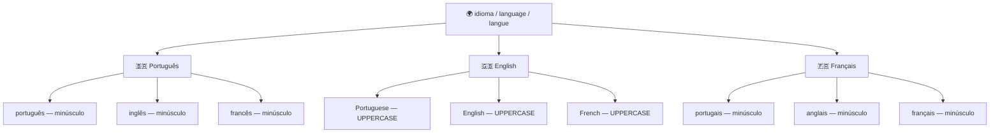

## 2. Grammar Map — Capitalization Rules

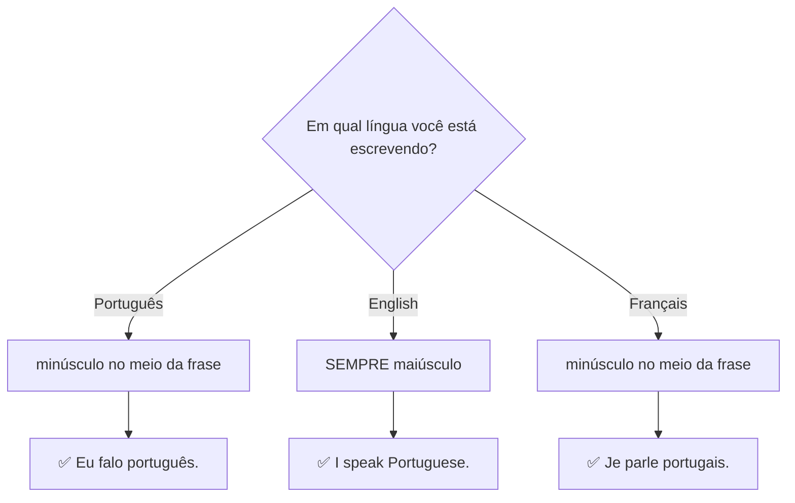

## 3. PT → EN → FR Examples

| Português | English | Français |
|---|---|---|
| Minha língua materna é o português. | My native language is Portuguese. | Ma langue maternelle est le portugais. |
| Eu falo inglês e português. | I speak English and Portuguese. | Je parle anglais et portugais. |
| Eu estou aprendendo francês. | I am learning French. | J'apprends le français. |
| Quero melhorar meu inglês. | I want to improve my English. | Je veux améliorer mon anglais. |
| Eu falo três idiomas. | I speak three languages. | Je parle trois langues. |

## 4. Common Mistakes

❌ I speak portuguese and english.
✅ I speak **Portuguese** and **English**.
📌 Em inglês, nomes de idiomas **sempre** começam com maiúscula.

❌ My mother language is Portuguese.
✅ My **native language** is Portuguese.
📌 "Mother language" soa não natural. Use **native language** ou **mother tongue**.

❌ Je parle Portugais.
✅ Je parle **portugais**.
📌 Em francês, idiomas são minúsculos, igual ao português.

## 5. Practice

Complete em inglês e francês:

1. I speak ______. (português) → Je parle ______.
2. My native language is ______. (português)
3. I am learning ______. (francês) → J'apprends le ______.
4. She speaks ______ and ______. (inglês e francês)
5. Translate: "Minha língua materna é o português."

---

## Answers / Respostas / Réponses

1. I speak **Portuguese**. / Je parle **portugais**.
2. My native language is **Portuguese**.
3. I am learning **French**. / J'apprends le **français**.
4. She speaks **English** and **French**. / Elle parle **anglais** et **français**.
5. My native language is Portuguese. / Ma langue maternelle est le portugais.
````

- [ ] **Step 3: Run verify expecting pass**

```bash
./scripts/verify-lesson.sh vocabulary/01-idiomas.md vocab
```

Expected:
```
✅ File exists
✅ Mermaid diagrams: 2 (expected >= 2)
✅ Section: Vocabulary Tree
✅ Section: Grammar Map
✅ Section: Examples
✅ Section: Common Mistakes
✅ Section: Practice
✅ PT/EN/FR columns present

✅ ALL CHECKS PASSED
```

- [ ] **Step 4: Commit**

```bash
git add vocabulary/01-idiomas.md
git commit -m "feat: add vocabulary lesson 01 — languages"
```

---

### Task 3: vocabulary/02-acoes.md — Actions

**Files:**
- Create: `vocabulary/02-acoes.md`

**Interfaces:**
- Produces: lesson on action verbs (write, speak, learn, improve, study) with irregular verb forms

- [ ] **Step 1: Run verify expecting failure**

```bash
./scripts/verify-lesson.sh vocabulary/02-acoes.md vocab
```

Expected: `❌ File not found`

- [ ] **Step 2: Create vocabulary/02-acoes.md**

````markdown
# 02 — Ações / Actions / Actions

## 1. Vocabulary Tree

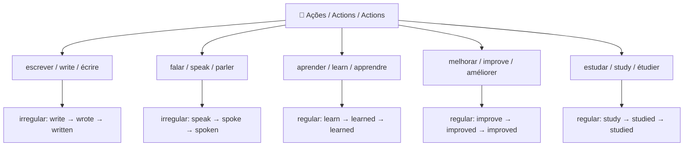

## 2. Grammar Map — Verb Tenses (write / écrire)

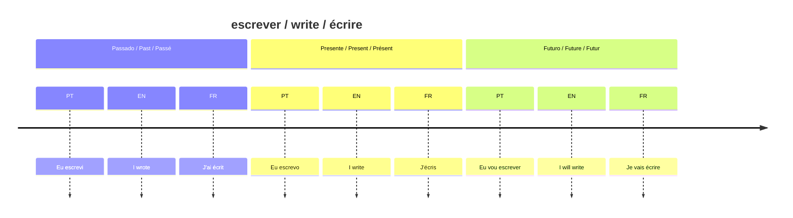

## 3. PT → EN → FR Examples

| Português | English | Français |
|---|---|---|
| Eu escrevo todos os dias. | I write every day. | J'écris tous les jours. |
| Eu escrevi uma mensagem ontem. | I wrote a message yesterday. | J'ai écrit un message hier. |
| Eu falo português e inglês. | I speak Portuguese and English. | Je parle portugais et anglais. |
| Eu estou aprendendo francês. | I am learning French. | J'apprends le français. |
| Eu quero melhorar meu inglês. | I want to improve my English. | Je veux améliorer mon anglais. |

## 4. Common Mistakes

❌ I writed a message.
✅ I **wrote** a message.
📌 "Write" é irregular. Nunca adicione "-ed". Formas: **write → wrote → written**.

❌ I can writte in English.
✅ I can **write** in English.
📌 Uma única letra "t" — não "writte".

❌ I have write many texts.
✅ I have **written** many texts.
📌 Com "have/has", use o particípio passado: **written**, não "write" ou "wrote".

## 5. Practice

1. Yesterday, I ______ a message. (write — passado)
2. I have ______ many texts this month. (write — particípio)
3. She ______ Portuguese and English. (speak — presente)
4. We are ______ French together. (learn — presente contínuo)
5. Translate: "Eu quero melhorar meu francês."

---

## Answers / Respostas / Réponses

1. **wrote**
2. **written**
3. **speaks**
4. **learning**
5. I want to improve my French. / Je veux améliorer mon français.
````

- [ ] **Step 3: Run verify expecting pass**

```bash
./scripts/verify-lesson.sh vocabulary/02-acoes.md vocab
```

Expected: `✅ ALL CHECKS PASSED`

- [ ] **Step 4: Commit**

```bash
git add vocabulary/02-acoes.md
git commit -m "feat: add vocabulary lesson 02 — actions"
```

---

### Task 4: vocabulary/03-descricoes.md — Descriptions

**Files:**
- Create: `vocabulary/03-descricoes.md`

**Interfaces:**
- Produces: lesson on adjectives/nouns (necessary, together, student, correct) with spelling tricks

- [ ] **Step 1: Run verify expecting failure**

```bash
./scripts/verify-lesson.sh vocabulary/03-descricoes.md vocab
```

Expected: `❌ File not found`

- [ ] **Step 2: Create vocabulary/03-descricoes.md**

````markdown
# 03 — Descrições / Descriptions / Descriptions

## 1. Vocabulary Tree

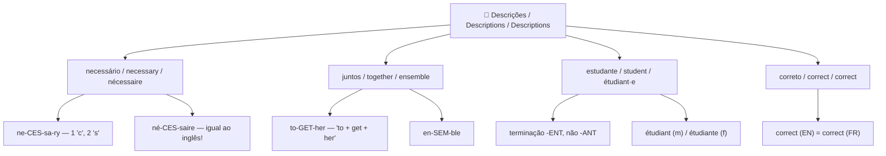

## 2. Grammar Map — Adjective Position

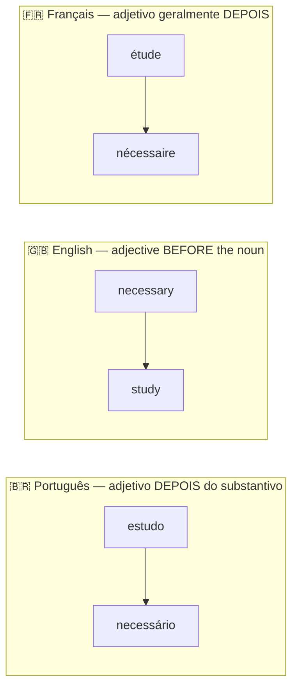

## 3. PT → EN → FR Examples

| Português | English | Français |
|---|---|---|
| Disciplina é necessária. | Discipline is necessary. | La discipline est nécessaire. |
| Nós podemos estudar juntos. | We can study together. | Nous pouvons étudier ensemble. |
| Eu sou estudante de idiomas. | I am a language student. | Je suis étudiant en langues. |
| A resposta está correta. | The answer is correct. | La réponse est correcte. |
| É necessário praticar todos os dias. | It is necessary to practice every day. | Il est nécessaire de pratiquer tous les jours. |

## 4. Common Mistakes

❌ nescessary / nessessary
✅ **necessary**
📌 Truque de ortografia: 1 "c" e 2 "s" — ne**c**e**ss**ary

❌ studant
✅ **student**
📌 A terminação é **-ent**, não "-ant": stud**ent**.

❌ togheter
✅ **together**
📌 Pense assim: **to + get + her** = together.

## 5. Practice

1. Discipline is ______ to learn a language.
2. We can study ______.
3. I am a language ______.
4. Correct the spelling: "nescessary studant togheter"
5. Translate: "É necessário estudar juntos todos os dias."

---

## Answers / Respostas / Réponses

1. **necessary**
2. **together**
3. **student**
4. **necessary student together**
5. It is necessary to study together every day. / Il est nécessaire d'étudier ensemble tous les jours.
````

- [ ] **Step 3: Run verify expecting pass**

```bash
./scripts/verify-lesson.sh vocabulary/03-descricoes.md vocab
```

Expected: `✅ ALL CHECKS PASSED`

- [ ] **Step 4: Commit**

```bash
git add vocabulary/03-descricoes.md
git commit -m "feat: add vocabulary lesson 03 — descriptions"
```

---

### Task 5: grammar/01-verb-tenses.md — Verb Tenses

**Files:**
- Create: `grammar/01-verb-tenses.md`

**Interfaces:**
- Produces: grammar lesson on present/past/future tenses with irregular verb table

- [ ] **Step 1: Run verify expecting failure**

```bash
./scripts/verify-lesson.sh grammar/01-verb-tenses.md grammar
```

Expected: `❌ File not found`

- [ ] **Step 2: Create grammar/01-verb-tenses.md**

````markdown
# 01 — Tempos Verbais / Verb Tenses / Temps Verbaux

## 1. Grammar Map

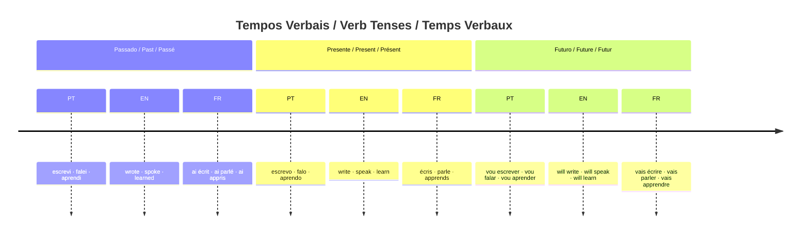

### Irregular verbs — quick reference

| Infinitive | Past (EN) | Past Participle (EN) | Passé Composé (FR) |
|---|---|---|---|
| write / écrire | wrote | written | j'ai écrit |
| speak / parler | spoke | spoken | j'ai parlé |
| learn / apprendre | learned | learned | j'ai appris |
| improve / améliorer | improved | improved | j'ai amélioré |
| study / étudier | studied | studied | j'ai étudié |

## 2. PT → EN → FR Examples

| Português | English | Français |
|---|---|---|
| Eu escrevo todos os dias. | I write every day. | J'écris tous les jours. |
| Eu escrevi uma mensagem ontem. | I wrote a message yesterday. | J'ai écrit un message hier. |
| Eu tenho escrito muito. | I have written a lot. | J'ai beaucoup écrit. |
| Eu vou escrever amanhã. | I will write tomorrow. | Je vais écrire demain. |
| Ela falou comigo ontem. | She spoke to me yesterday. | Elle m'a parlé hier. |

## 3. Common Mistakes

❌ I writed a message.
✅ I **wrote** a message.
📌 "Write" é irregular. Nunca adicione "-ed" em verbos irregulares.

❌ I have write many texts.
✅ I have **written** many texts.
📌 Com "have/has/had", use sempre o particípio passado: **written**, não "wrote" ou "write".

❌ J'ai écris un message. *(erro comum em francês)*
✅ J'ai **écrit** un message.
📌 O particípio de "écrire" é **écrit**, não "écris".

## 4. Practice

1. Yesterday, I ______ a message. (write — passado)
2. I have ______ many texts this month. (write — particípio)
3. She ______ to me yesterday. (speak — passado)
4. We ______ French every day. (learn — presente)
5. Translate: "Eu tenho aprendido muito francês."

---

## Answers / Respostas / Réponses

1. **wrote**
2. **written**
3. **spoke**
4. **learn**
5. I have learned a lot of French. / J'ai beaucoup appris le français.
````

- [ ] **Step 3: Run verify expecting pass**

```bash
./scripts/verify-lesson.sh grammar/01-verb-tenses.md grammar
```

Expected: `✅ ALL CHECKS PASSED`

- [ ] **Step 4: Commit**

```bash
git add grammar/01-verb-tenses.md
git commit -m "feat: add grammar lesson 01 — verb tenses"
```

---

### Task 6: grammar/02-sentence-structure.md — Sentence Structure

**Files:**
- Create: `grammar/02-sentence-structure.md`

**Interfaces:**
- Produces: grammar lesson on word order and negation patterns in PT vs EN vs FR

- [ ] **Step 1: Run verify expecting failure**

```bash
./scripts/verify-lesson.sh grammar/02-sentence-structure.md grammar
```

Expected: `❌ File not found`

- [ ] **Step 2: Create grammar/02-sentence-structure.md**

````markdown
# 02 — Estrutura da Frase / Sentence Structure / Structure de la Phrase

## 1. Grammar Map

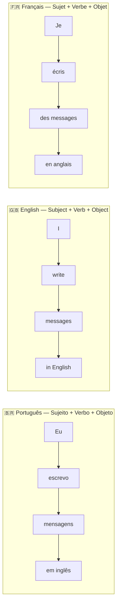

### Negation patterns

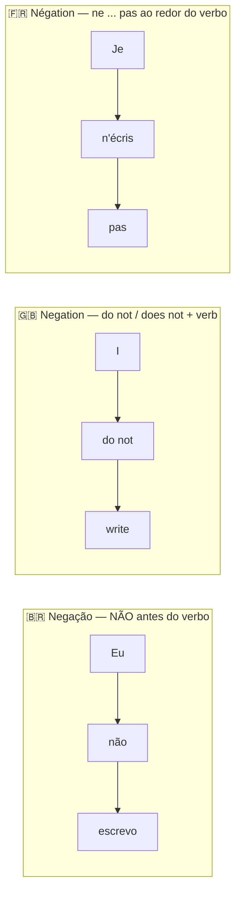

## 2. PT → EN → FR Examples

| Português | English | Français |
|---|---|---|
| Eu escrevo mensagens em inglês. | I write messages in English. | J'écris des messages en anglais. |
| Eu não escrevo em francês ainda. | I do not write in French yet. | Je n'écris pas encore en français. |
| Ela fala três idiomas. | She speaks three languages. | Elle parle trois langues. |
| Eu nunca fui um bom estudante. | I was never a good student. | Je n'ai jamais été un bon étudiant. |
| Eu quero melhorar meu inglês. | I want to improve my English. | Je veux améliorer mon anglais. |

## 3. Common Mistakes

❌ I never was a good student.
✅ I **was never** a good student.
📌 Em inglês, **never** vai ENTRE o verbo auxiliar (was) e o verbo principal. Pense: sujeito + aux + never + verbo.

❌ I not write in French.
✅ I **do not** write in French.
📌 Em inglês, negação precisa de "do not / does not". Nunca apenas "not" sozinho.

❌ Je parle pas anglais. *(erro comum em francês)*
✅ Je **ne** parle **pas** anglais.
📌 Em francês, a negação tem duas partes: **ne ... pas** ao redor do verbo.

## 4. Practice

1. Reorder the words: "every day / I / English / study" → ______
2. Make negative: "I write in French." → ______
3. Translate: "Ela não fala inglês."
4. Translate: "Eu nunca fui um bom estudante."
5. Make negative in French: "Je parle anglais." → ______

---

## Answers / Respostas / Réponses

1. **I study English every day.**
2. **I do not write in French.**
3. She does not speak English. / Elle ne parle pas anglais.
4. I was never a good student. / Je n'ai jamais été un bon étudiant.
5. **Je ne parle pas anglais.**
````

- [ ] **Step 3: Run verify expecting pass**

```bash
./scripts/verify-lesson.sh grammar/02-sentence-structure.md grammar
```

Expected: `✅ ALL CHECKS PASSED`

- [ ] **Step 4: Commit**

```bash
git add grammar/02-sentence-structure.md
git commit -m "feat: add grammar lesson 02 — sentence structure"
```

---

### Task 7: grammar/03-articles-gender.md — Articles & Gender

**Files:**
- Create: `grammar/03-articles-gender.md`

**Interfaces:**
- Produces: grammar lesson on article choice with decision tree — a/an/the vs le/la/les/un/une

- [ ] **Step 1: Run verify expecting failure**

```bash
./scripts/verify-lesson.sh grammar/03-articles-gender.md grammar
```

Expected: `❌ File not found`

- [ ] **Step 2: Create grammar/03-articles-gender.md**

````markdown
# 03 — Artigos e Gênero / Articles & Gender / Articles et Genre

## 1. Grammar Map

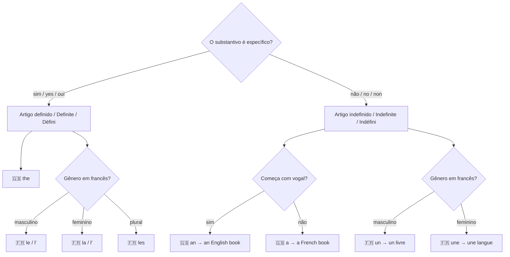

### Gender of common nouns in French

| Substantivo | Gênero | Artigo definido | Artigo indefinido |
|---|---|---|---|
| langue (language) | feminino | la langue | une langue |
| étudiant (student m.) | masculino | l'étudiant | un étudiant |
| étudiante (student f.) | feminino | l'étudiante | une étudiante |
| livre (book) | masculino | le livre | un livre |
| mot (word) | masculino | le mot | un mot |
| grammaire (grammar) | feminino | la grammaire | une grammaire |

## 2. PT → EN → FR Examples

| Português | English | Français |
|---|---|---|
| O estudante fala inglês. | The student speaks English. | L'étudiant parle anglais. |
| Um estudante fala inglês. | A student speaks English. | Un étudiant parle anglais. |
| A língua é difícil. | The language is difficult. | La langue est difficile. |
| Uma nova língua é desafiadora. | A new language is challenging. | Une nouvelle langue est stimulante. |
| Os idiomas são belos. | Languages are beautiful. | Les langues sont belles. |

📌 **Diferença importante:** Em inglês, não usamos artigo com idiomas e assuntos gerais:
- 🇧🇷 **O** inglês é difícil. → 🇬🇧 English is hard. *(sem artigo)*
- 🇫🇷 **L'**anglais est difficile. *(com artigo)*

## 3. Common Mistakes

❌ I am an student.
✅ I am **a** student.
📌 "Student" começa com consoante "s", então usa **a**, não "an".

❌ She is a English teacher.
✅ She is **an** English teacher.
📌 "English" começa com vogal "E", então usa **an**.

❌ English is a difficult. *(artigo errado)*
✅ English is **a** difficult language. / English is difficult.
📌 "Difficult" é adjetivo, não substantivo. O artigo vai antes do substantivo.

## 4. Practice

1. She is ______ English teacher. (a / an)
2. I am ______ language student. (a / an)
3. ______ French language is beautiful. (The / A)
4. Translate: "Um estudante fala três idiomas."
5. In French — choose the article: "______ langue" (a language, feminino) → ______

---

## Answers / Respostas / Réponses

1. **an** (English starts with a vowel)
2. **a** (language starts with a consonant)
3. **The**
4. A student speaks three languages. / Un étudiant parle trois langues.
5. **une** langue
````

- [ ] **Step 3: Run verify expecting pass**

```bash
./scripts/verify-lesson.sh grammar/03-articles-gender.md grammar
```

Expected: `✅ ALL CHECKS PASSED`

- [ ] **Step 4: Commit**

```bash
git add grammar/03-articles-gender.md
git commit -m "feat: add grammar lesson 03 — articles and gender"
```

---

### Task 8: grammar/04-prepositions.md — Prepositions

**Files:**
- Create: `grammar/04-prepositions.md`

**Interfaces:**
- Produces: grammar lesson on prepositions for time, place, and language context

- [ ] **Step 1: Run verify expecting failure**

```bash
./scripts/verify-lesson.sh grammar/04-prepositions.md grammar
```

Expected: `❌ File not found`

- [ ] **Step 2: Create grammar/04-prepositions.md**

````markdown
# 04 — Preposições / Prepositions / Prépositions

## 1. Grammar Map

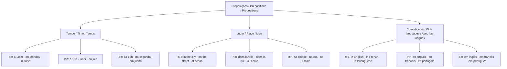

### Quick reference table

| Contexto | Português | English | Français |
|---|---|---|---|
| Idioma | em inglês | **in** English | **en** anglais |
| Dia da semana | na segunda | **on** Monday | **le** lundi |
| Hora | às 15h | **at** 3pm | **à** 15h |
| Mês | em junho | **in** June | **en** juin |
| Lugar (dentro) | na escola | **at** school | **à** l'école |
| País | no Brasil | **in** Brazil | **au** Brésil |

## 2. PT → EN → FR Examples

| Português | English | Français |
|---|---|---|
| Eu escrevo em inglês. | I write in English. | J'écris en anglais. |
| Eu estudo à noite. | I study at night. | J'étudie le soir. |
| Eu estudo na escola. | I study at school. | J'étudie à l'école. |
| Eu aprendo inglês na segunda-feira. | I learn English on Monday. | J'apprends l'anglais le lundi. |
| Eu moro no Brasil. | I live in Brazil. | J'habite au Brésil. |

## 3. Common Mistakes

❌ I write on English.
✅ I write **in** English.
📌 Para idiomas: sempre **in** em inglês / **en** em francês: in English / en anglais.

❌ I study in Monday.
✅ I study **on** Monday.
📌 Para dias da semana em inglês: sempre **on** — on Monday, on Friday, on Sunday.

❌ J'écris en lundi. *(erro comum em francês)*
✅ J'écris **le** lundi.
📌 Em francês, dias da semana usam **le** (sem preposição "en").

## 4. Practice

1. I write ______ English. (in / on / at)
2. I study ______ Monday. (in / on / at)
3. She lives ______ Brazil. (in / on / at)
4. Translate: "Eu escrevo em inglês na segunda-feira."
5. In French: "J'écris ______ anglais." (choose: en / le / à)

---

## Answers / Respostas / Réponses

1. **in** English
2. **on** Monday
3. **in** Brazil
4. I write in English on Monday. / J'écris en anglais le lundi.
5. J'écris **en** anglais.
````

- [ ] **Step 3: Run verify expecting pass**

```bash
./scripts/verify-lesson.sh grammar/04-prepositions.md grammar
```

Expected: `✅ ALL CHECKS PASSED`

- [ ] **Step 4: Commit**

```bash
git add grammar/04-prepositions.md
git commit -m "feat: add grammar lesson 04 — prepositions"
```

---

### Task 9: exercises/week-01.md — Week 1 Exercises

**Files:**
- Create: `exercises/week-01.md`

**Interfaces:**
- Consumes: vocabulary and grammar from all 8 lesson files
- Produces: 3-type exercise file with answers after `---`

- [ ] **Step 1: Verify file does not exist**

```bash
ls exercises/week-01.md 2>/dev/null && echo "EXISTS" || echo "OK"
```

Expected: `OK`

- [ ] **Step 2: Create exercises/week-01.md**

````markdown
# Exercícios — Week 01 / Semaine 01

Tente responder **sem olhar as respostas**. Depois compare com a seção de respostas abaixo.

---

## Tipo 1 — Complete nas 3 línguas / Fill in the blank (3 languages)

Complete a mesma frase em inglês e francês:

**1.** Eu falo ______. → I speak ______. → Je parle ______.
*(português / Portuguese / portugais)*

**2.** Eu ______ uma mensagem ontem. → I ______ a message yesterday. → J'______ un message hier.
*(escrevi / wrote / ai écrit)*

**3.** É ______ estudar um pouco todos os dias. → It is ______ to study a little every day. → Il est ______ d'étudier un peu tous les jours.
*(necessário / necessary / nécessaire)*

**4.** Nós podemos estudar ______. → We can study ______. → Nous pouvons étudier ______.
*(juntos / together / ensemble)*

**5.** Eu sou ______ de idiomas. → I am a language ______. → Je suis ______ en langues.
*(estudante / student / étudiant)*

---

## Tipo 2 — Corrija o erro / Spot the mistake

Encontre e corrija o erro em cada frase:

**1.** ❌ I speak portuguese and english.

**2.** ❌ I writed a message yesterday.

**3.** ❌ We can study togheter.

**4.** ❌ I am an studant of languages.

**5.** ❌ I write on English every day.

**6.** ❌ I never was a good student.

**7.** ❌ She is a English teacher.

---

## Tipo 3 — Tradução livre / Free translation

Traduza para **inglês E francês**:

**1.** Nós podemos estudar juntos.

**2.** É necessário praticar todos os dias.

**3.** Eu quero melhorar minha gramática.

**4.** Ela é estudante de idiomas.

**5.** Eu escrevo em inglês e em francês.

---
---

## Respostas / Answers / Réponses

### Tipo 1

1. I speak **Portuguese**. / Je parle **portugais**.
2. I **wrote** a message yesterday. / J'**ai écrit** un message hier.
3. It is **necessary** to study a little every day. / Il est **nécessaire** d'étudier un peu tous les jours.
4. We can study **together**. / Nous pouvons étudier **ensemble**.
5. I am a language **student**. / Je suis **étudiant** en langues.

### Tipo 2

1. ✅ I speak **Portuguese** and **English**. *(idiomas em inglês = maiúscula)*
2. ✅ I **wrote** a message yesterday. *("write" é irregular: write → wrote)*
3. ✅ We can study **together**. *(ortografia: to + get + her)*
4. ✅ I am **a** student of languages. *("student" começa com consoante → "a", não "an")*
5. ✅ I write **in** English every day. *(idiomas usam "in", não "on")*
6. ✅ I **was never** a good student. *("never" vai entre o auxiliar e o verbo principal)*
7. ✅ She is **an** English teacher. *("English" começa com vogal → "an")*

### Tipo 3

1. We can study together. / Nous pouvons étudier ensemble.
2. It is necessary to practice every day. / Il est nécessaire de pratiquer tous les jours.
3. I want to improve my grammar. / Je veux améliorer ma grammaire.
4. She is a language student. / Elle est étudiante en langues.
5. I write in English and in French. / J'écris en anglais et en français.
````

- [ ] **Step 3: Verify file structure**

```bash
grep -c "Tipo" exercises/week-01.md
```

Expected: `6` (3 headings + 3 answer sections)

```bash
grep -c "Respostas" exercises/week-01.md
```

Expected: `1`

- [ ] **Step 4: Commit**

```bash
git add exercises/week-01.md
git commit -m "feat: add week 01 exercises"
```

---

### Task 10: Final — Remove .gitkeep files + update README checkboxes

**Files:**
- Delete: `vocabulary/.gitkeep`, `grammar/.gitkeep`, `exercises/.gitkeep`

- [ ] **Step 1: Remove .gitkeep files**

```bash
rm vocabulary/.gitkeep grammar/.gitkeep exercises/.gitkeep
```

- [ ] **Step 2: Verify all lesson files present**

```bash
find vocabulary grammar exercises -name "*.md" | sort
```

Expected:
```
exercises/week-01.md
grammar/01-verb-tenses.md
grammar/02-sentence-structure.md
grammar/03-articles-gender.md
grammar/04-prepositions.md
vocabulary/01-idiomas.md
vocabulary/02-acoes.md
vocabulary/03-descricoes.md
```

- [ ] **Step 3: Run verify on all lesson files**

```bash
for f in vocabulary/*.md; do ./scripts/verify-lesson.sh "$f" vocab; echo "---"; done
for f in grammar/*.md; do ./scripts/verify-lesson.sh "$f" grammar; echo "---"; done
```

Expected: all print `✅ ALL CHECKS PASSED`

- [ ] **Step 4: Final commit**

```bash
git add -A
git commit -m "chore: remove .gitkeep files — all lesson files in place"
```
