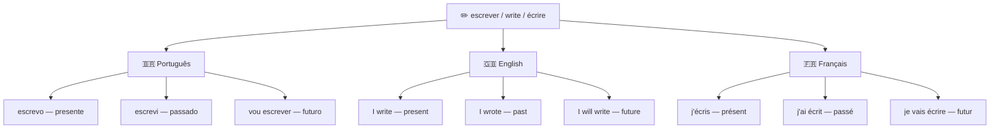
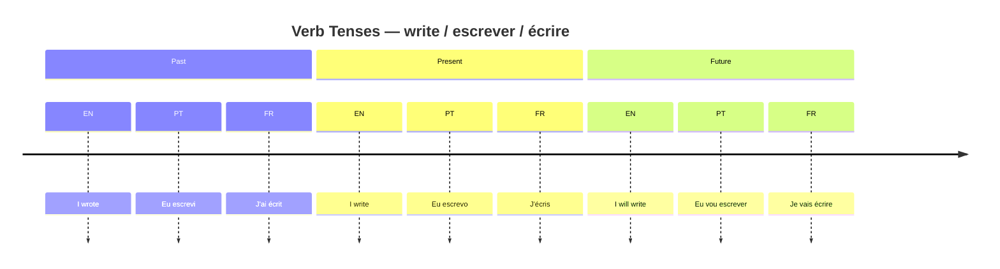
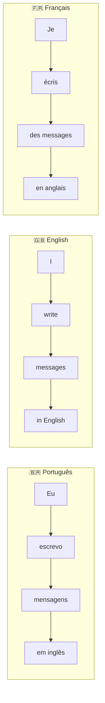
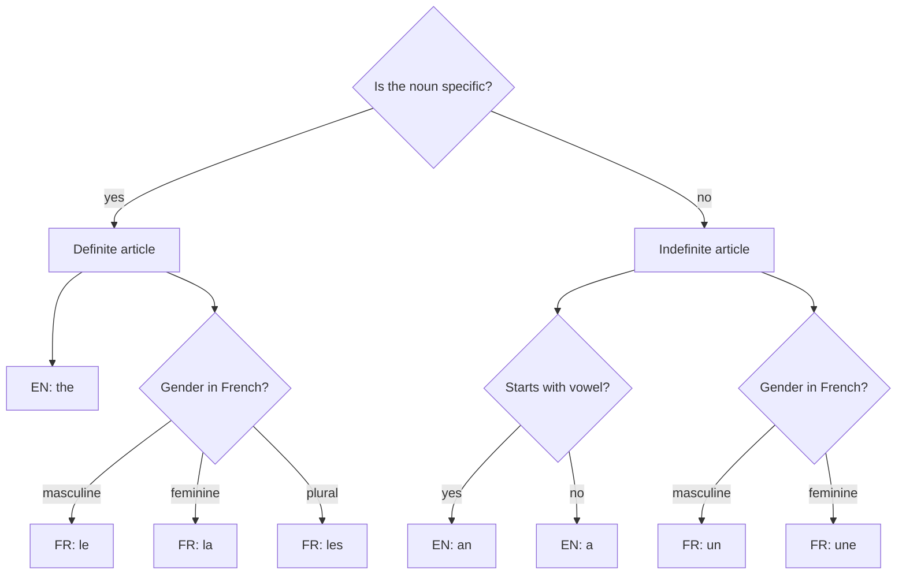

# Multi-Language Lesson System — Design Spec

**Date:** 2026-06-16
**Project:** mult_lang
**Languages:** Portuguese (base) → English → French
**Output format:** Markdown files with Mermaid diagrams

---

## Goal

Build a structured, self-paced language lesson system that teaches English and French through Portuguese as the base language. Each lesson uses Mermaid diagrams (vocabulary trees and grammar maps) to make abstract grammar rules visible and memorable.

---

## File Structure

```
mult_lang/
├── README.md                        ← progress dashboard / table of contents
├── vocabulary/
│   ├── 01-idiomas.md               (languages: português / English / français)
│   ├── 02-acoes.md                 (actions: escrever / write / écrire)
│   └── 03-descricoes.md            (descriptions: necessary / together / student)
├── grammar/
│   ├── 01-verb-tenses.md           (verb forms across tenses + timeline diagram)
│   ├── 02-sentence-structure.md    (word order PT vs EN vs FR)
│   ├── 03-articles-gender.md       (a/an/the vs le/la/les/un/une)
│   └── 04-prepositions.md          (in/on/at vs à/de/en/dans)
└── exercises/
    └── week-01.md                  (practice using all week-1 vocabulary + grammar)
```

---

## README Format

The README is a progress dashboard. Each lesson is a checkbox. The user marks lessons complete as they go.

```markdown
# mult_lang — Progress Tracker

## Vocabulary
- [ ] 01 — Idiomas (languages)
- [ ] 02 — Ações (actions)
- [ ] 03 — Descrições (descriptions)

## Grammar
- [ ] 01 — Verb tenses
- [ ] 02 — Sentence structure
- [ ] 03 — Articles & gender
- [ ] 04 — Prepositions

## Exercises
- [ ] Week 01
```

---

## Lesson File Template

**Vocabulary files** always contain both diagrams:

```
# Lesson Title — PT / EN / FR

## 1. Vocabulary Tree (Mermaid)
## 2. Grammar Map (Mermaid)
## 3. PT → EN → FR Examples (table)
## 4. Common Mistakes
## 5. Practice (with answers at bottom)
```

**Grammar files** omit the vocabulary tree and focus on the grammar map:

```
# Grammar Topic — PT / EN / FR

## 1. Grammar Map (Mermaid)
## 2. PT → EN → FR Examples (table)
## 3. Common Mistakes
## 4. Practice (with answers at bottom)
```

---

## Mermaid Diagram Types by Topic

| File | Vocabulary diagram | Grammar diagram |
|---|---|---|
| vocabulary/01-idiomas.md | `graph TD` — word branches per language | `graph TD` — capitalization rules |
| vocabulary/02-acoes.md | `graph TD` — verb family tree | `timeline` — tense progression |
| vocabulary/03-descricoes.md | `graph TD` — adjective family tree | `graph LR` — adjective position in sentences |
| grammar/01-verb-tenses.md | `graph TD` — irregular verb forms | `timeline` — past / present / future |
| grammar/02-sentence-structure.md | — | `graph LR` — word order comparison |
| grammar/03-articles-gender.md | — | `graph TD` — decision tree for article choice |
| grammar/04-prepositions.md | — | `graph TD` — flowchart for preposition choice |

---

## Vocabulary Tree — Example (escrever / write / écrire)



---

## Grammar Map Examples

### Timeline (verb tenses)



### Word order comparison (sentence structure)



### Decision tree (articles & gender)



---

## Common Mistake Block Format

Each lesson ends with a "Common Mistakes" section using this format:

```markdown
## Common Mistakes

❌ I never was a good student.
✅ I **was never** a good student.
📌 Em inglês, **never** vai entre o verbo auxiliar e o verbo principal.

❌ My mother language is portuguese.
✅ My **native language** is **Portuguese**.
📌 "Mother language" soa não natural. Use "native language". Idiomas em inglês sempre com maiúscula.
```

---

## Exercise File Format

Three exercise types per weekly file:

**Type 1 — Fill in the blank (3 languages)**
Complete the same sentence in all 3 languages.

**Type 2 — Spot the mistake**
Find and correct errors in English and French sentences.

**Type 3 — Free translation**
Translate Portuguese sentences to English AND French.

Answers are separated at the bottom of the file so the student can practice without seeing them immediately.

---

## Grammar Topics Scope

| Topic | English focus | French focus |
|---|---|---|
| Verb tenses | write/wrote/written; irregular verbs | présent/passé composé/futur proche |
| Sentence structure | Subject + Verb + Object word order | Same base order but with gender agreement |
| Articles & gender | a/an vs the; no gender | le/la/les vs un/une; all nouns have gender |
| Prepositions | in/on/at (time + place) | à/de/en/dans; common contractions (au/du) |

---

## Success Criteria

- Each lesson file is self-contained and can be read independently
- Mermaid diagrams render correctly in GitHub and VS Code
- Every grammar rule is shown in all 3 languages with a PT explanation
- Common mistakes come from real errors made during study sessions
- Exercises have clear answers so the student can self-correct
