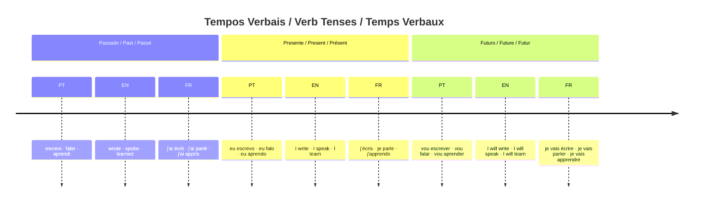
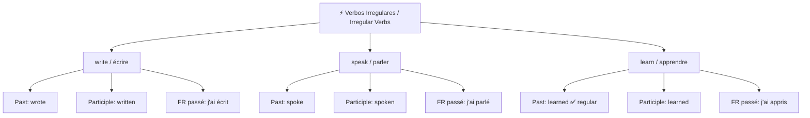

# 01 — Tempos Verbais / Verb Tenses / Temps Verbaux

## 1. Grammar Map

### Irregular verbs — graph TD

### Irregular verbs — quick reference

| Infinitive | Past (EN) | Past Participle (EN) | Passé Composé (FR) |
|---|---|---|---|
| write / écrire | wrote | written | j'ai écrit |
| speak / parler | spoke | spoken | j'ai parlé |
| learn / apprendre | learned | learned | j'ai appris |
| improve / améliorer | improved | improved | j'ai amélioré |
| study / étudier | studied | studied | j'ai étudié |

## 2. PT → EN → FR Examples

| Português | English | Français |
|---|---|---|
| Eu escrevo todos os dias. | I write every day. | J'écris tous les jours. |
| Eu escrevi uma mensagem ontem. | I wrote a message yesterday. | J'ai écrit un message hier. |
| Eu tenho escrito muito. | I have written a lot. | J'ai beaucoup écrit. |
| Eu vou escrever amanhã. | I will write tomorrow. | Je vais écrire demain. |
| Ela falou comigo ontem. | She spoke to me yesterday. | Elle m'a parlé hier. |

## 3. Common Mistakes

❌ She speaked to me yesterday.
✅ She **spoke** to me yesterday.
📌 "Speak" é irregular. Nunca adicione "-ed": speak → **spoke** → spoken.

❌ I have speak French for one year.
✅ I have **spoken** French for one year.
📌 Com "have/has", use sempre o particípio: **spoken**, não "speak" ou "spoke".

❌ J'ai écris un message. *(erro comum em francês)*
✅ J'ai **écrit** un message.
📌 O particípio de "écrire" é **écrit**, não "écris".

## 4. Practice

1. Yesterday, I ______ a message. (write — passado)
2. I have ______ many texts this month. (write — particípio)
3. She ______ to me yesterday. (speak — passado)
4. We ______ French every day. (learn — presente)
5. Translate: "Eu tenho aprendido muito francês."

---

## Answers / Respostas / Réponses

1. **wrote**
2. **written**
3. **spoke**
4. **learn**
5. I have learned a lot of French. / J'ai beaucoup appris le français.
