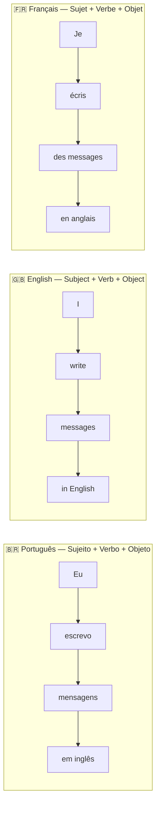
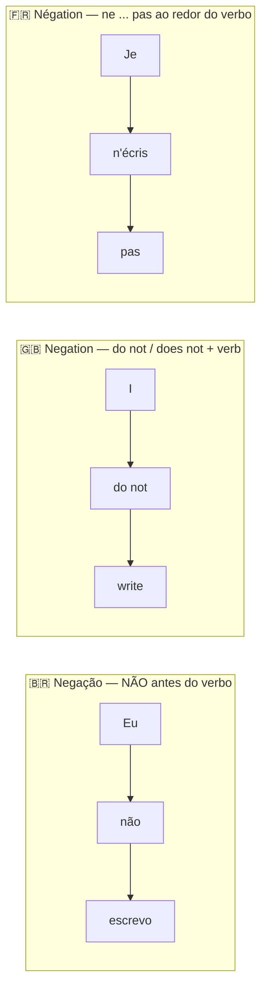

# 02 — Estrutura da Frase / Sentence Structure / Structure de la Phrase

## 1. Grammar Map

### Negation patterns

## 2. PT → EN → FR Examples

| Português | English | Français |
|---|---|---|
| Eu escrevo mensagens em inglês. | I write messages in English. | J'écris des messages en anglais. |
| Eu não escrevo em francês ainda. | I do not write in French yet. | Je n'écris pas encore en français. |
| Ela fala três idiomas. | She speaks three languages. | Elle parle trois langues. |
| Eu nunca fui um bom estudante. | I was never a good student. | Je n'ai jamais été un bon étudiant. |
| Eu quero melhorar meu inglês. | I want to improve my English. | Je veux améliorer mon anglais. |

## 3. Common Mistakes

❌ I never was a good student.
✅ I **was never** a good student.
📌 Em inglês, **never** vai ENTRE o verbo auxiliar (was) e o verbo principal. Pense: sujeito + aux + never + verbo.

❌ I not write in French.
✅ I **do not** write in French.
📌 Em inglês, negação precisa de "do not / does not". Nunca apenas "not" sozinho.

❌ Je parle pas anglais. *(erro comum em francês)*
✅ Je **ne** parle **pas** anglais.
📌 Em francês, a negação tem duas partes: **ne ... pas** ao redor do verbo.

## 4. Practice

1. Reorder the words: "every day / I / English / study" → ______
2. Make negative: "I write in French." → ______
3. Translate: "Ela não fala inglês."
4. Translate: "Eu nunca fui um bom estudante."
5. Make negative in French: "Je parle anglais." → ______

---

## Answers / Respostas / Réponses

1. **I study English every day.**
2. **I do not write in French.**
3. She does not speak English. / Elle ne parle pas anglais.
4. I was never a good student. / Je n'ai jamais été un bon étudiant.
5. **Je ne parle pas anglais.**
