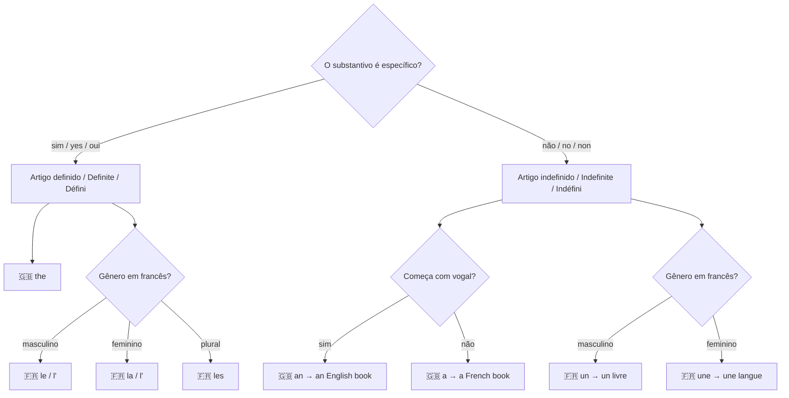

# 03 — Artigos e Gênero / Articles & Gender / Articles et Genre

## 1. Grammar Map

### Gender of common nouns in French

| Substantivo | Gênero | Artigo definido | Artigo indefinido |
|---|---|---|---|
| langue (language) | feminino | la langue | une langue |
| étudiant (student m.) | masculino | l'étudiant | un étudiant |
| étudiante (student f.) | feminino | l'étudiante | une étudiante |
| livre (book) | masculino | le livre | un livre |
| mot (word) | masculino | le mot | un mot |
| grammaire (grammar) | feminino | la grammaire | une grammaire |

## 2. PT → EN → FR Examples

| Português | English | Français |
|---|---|---|
| O estudante fala inglês. | The student speaks English. | L'étudiant parle anglais. |
| Um estudante fala inglês. | A student speaks English. | Un étudiant parle anglais. |
| A língua é difícil. | The language is difficult. | La langue est difficile. |
| Uma nova língua é desafiadora. | A new language is challenging. | Une nouvelle langue est stimulante. |
| Os idiomas são belos. | Languages are beautiful. | Les langues sont belles. |

📌 **Diferença importante:** Em inglês, não usamos artigo com idiomas e assuntos gerais:
- 🇧🇷 **O** inglês é difícil. → 🇬🇧 English is hard. *(sem artigo)*
- 🇫🇷 **L'**anglais est difficile. *(com artigo)*

## 3. Common Mistakes

❌ I am an student.
✅ I am **a** student.
📌 "Student" começa com consoante "s", então usa **a**, não "an".

❌ She is a English teacher.
✅ She is **an** English teacher.
📌 "English" começa com vogal "E", então usa **an**.

❌ English is a difficult. *(artigo errado)*
✅ English is **a** difficult language. / English is difficult.
📌 "Difficult" é adjetivo, não substantivo. O artigo vai antes do substantivo.

## 4. Practice

1. She is ______ English teacher. (a / an)
2. I am ______ language student. (a / an)
3. ______ French language is beautiful. (The / A)
4. Translate: "Um estudante fala três idiomas."
5. In French — choose the article: "______ langue" (a language, feminino) → ______

---

## Answers / Respostas / Réponses

1. **an** (English starts with a vowel)
2. **a** (language starts with a consonant)
3. **The**
4. A student speaks three languages. / Un étudiant parle trois langues.
5. **une** langue
