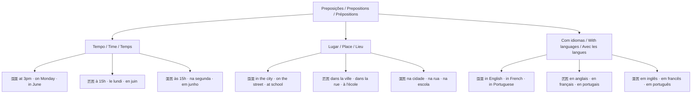

# 04 — Preposições / Prepositions / Prépositions

## 1. Grammar Map

### Quick reference table

| Contexto | Português | English | Français |
|---|---|---|---|
| Idioma | em inglês | **in** English | **en** anglais |
| Dia da semana | na segunda | **on** Monday | **le** lundi |
| Hora | às 15h | **at** 3pm | **à** 15h |
| Mês | em junho | **in** June | **en** juin |
| Lugar (dentro) | na escola | **at** school | **à** l'école |
| País | no Brasil | **in** Brazil | **au** Brésil |

## 2. PT → EN → FR Examples

| Português | English | Français |
|---|---|---|
| Eu escrevo em inglês. | I write in English. | J'écris en anglais. |
| Eu estudo à noite. | I study at night. | J'étudie le soir. |
| Eu estudo na escola. | I study at school. | J'étudie à l'école. |
| Eu aprendo inglês na segunda-feira. | I learn English on Monday. | J'apprends l'anglais le lundi. |
| Eu moro no Brasil. | I live in Brazil. | J'habite au Brésil. |

## 3. Common Mistakes

❌ I write on English.
✅ I write **in** English.
📌 Para idiomas: sempre **in** em inglês / **en** em francês: in English / en anglais.

❌ I study in Monday.
✅ I study **on** Monday.
📌 Para dias da semana em inglês: sempre **on** — on Monday, on Friday, on Sunday.

❌ J'écris en lundi. *(erro comum em francês)*
✅ J'écris **le** lundi.
📌 Em francês, dias da semana usam **le** (sem preposição "en").

## 4. Practice

1. I write ______ English. (in / on / at)
2. I study ______ Monday. (in / on / at)
3. She lives ______ Brazil. (in / on / at)
4. Translate: "Eu escrevo em inglês na segunda-feira."
5. In French: "J'écris ______ anglais." (choose: en / le / à)

---

## Answers / Respostas / Réponses

1. **in** English
2. **on** Monday
3. **in** Brazil
4. I write in English on Monday. / J'écris en anglais le lundi.
5. J'écris **en** anglais.
