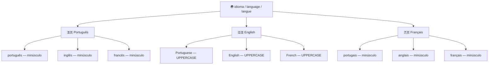
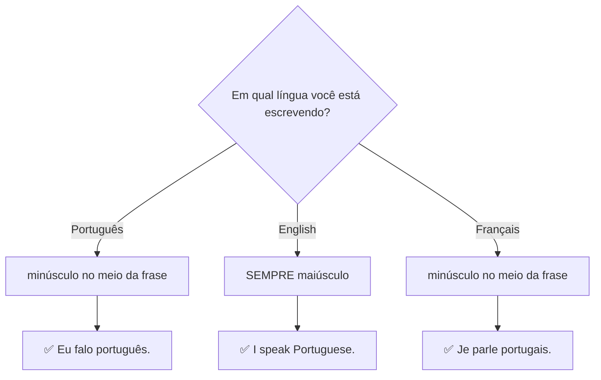

# 01 — Idiomas / Languages / Langues

## 1. Vocabulary Tree

## 2. Grammar Map — Capitalization Rules

## 3. PT → EN → FR Examples

| Português | English | Français |
|---|---|---|
| Minha língua materna é o português. | My native language is Portuguese. | Ma langue maternelle est le portugais. |
| Eu falo inglês e português. | I speak English and Portuguese. | Je parle anglais et portugais. |
| Eu estou aprendendo francês. | I am learning French. | J'apprends le français. |
| Quero melhorar meu inglês. | I want to improve my English. | Je veux améliorer mon anglais. |
| Eu falo três idiomas. | I speak three languages. | Je parle trois langues. |

## 4. Common Mistakes

❌ I speak portuguese and english.
✅ I speak **Portuguese** and **English**.
📌 Em inglês, nomes de idiomas **sempre** começam com maiúscula.

❌ My mother language is Portuguese.
✅ My **native language** is Portuguese.
📌 "Mother language" soa não natural. Use **native language** ou **mother tongue**.

❌ Je parle Portugais.
✅ Je parle **portugais**.
📌 Em francês, idiomas são minúsculos, igual ao português.

## 5. Practice

Complete em inglês e francês:

1. I speak ______. (português) → Je parle ______.
2. My native language is ______. (português)
3. I am learning ______. (francês) → J'apprends le ______.
4. She speaks ______ and ______. (inglês e francês)
5. Translate: "Minha língua materna é o português."

---

## Answers / Respostas / Réponses

1. I speak **Portuguese**. / Je parle **portugais**.
2. My native language is **Portuguese**.
3. I am learning **French**. / J'apprends le **français**.
4. She speaks **English** and **French**. / Elle parle **anglais** et **français**.
5. My native language is Portuguese. / Ma langue maternelle est le portugais.
