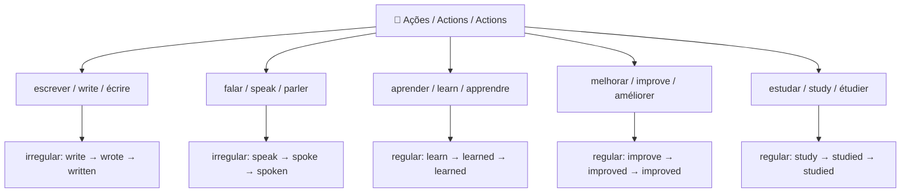
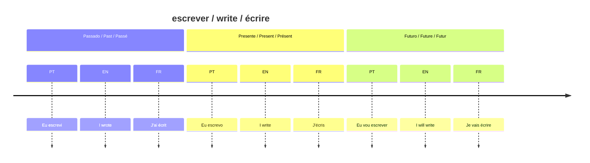

# 02 — Ações / Actions / Actions

## 1. Vocabulary Tree

## 2. Grammar Map — Verb Tenses (write / écrire)

## 3. PT → EN → FR Examples

| Português | English | Français |
|---|---|---|
| Eu escrevo todos os dias. | I write every day. | J'écris tous les jours. |
| Eu escrevi uma mensagem ontem. | I wrote a message yesterday. | J'ai écrit un message hier. |
| Eu falo português e inglês. | I speak Portuguese and English. | Je parle portugais et anglais. |
| Eu estou aprendendo francês. | I am learning French. | J'apprends le français. |
| Eu quero melhorar meu inglês. | I want to improve my English. | Je veux améliorer mon anglais. |

## 4. Common Mistakes

❌ I writed a message.
✅ I **wrote** a message.
📌 "Write" é irregular. Nunca adicione "-ed". Formas: **write → wrote → written**.

❌ I can writte in English.
✅ I can **write** in English.
📌 Uma única letra "t" — não "writte".

❌ I have write many texts.
✅ I have **written** many texts.
📌 Com "have/has", use o particípio passado: **written**, não "write" ou "wrote".

## 5. Practice

1. Yesterday, I ______ a message. (write — passado)
2. I have ______ many texts this month. (write — particípio)
3. She ______ Portuguese and English. (speak — presente)
4. We are ______ French together. (learn — presente contínuo)
5. Translate: "Eu quero melhorar meu francês."

---

## Answers / Respostas / Réponses

1. **wrote**
2. **written**
3. **speaks**
4. **learning**
5. I want to improve my French. / Je veux améliorer mon français.
