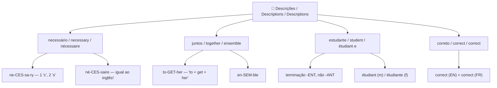
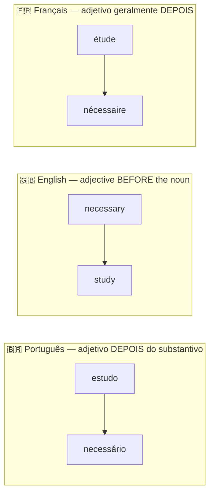

# 03 — Descrições / Descriptions / Descriptions

## 1. Vocabulary Tree

## 2. Grammar Map — Adjective Position

## 3. PT → EN → FR Examples

| Português | English | Français |
|---|---|---|
| Disciplina é necessária. | Discipline is necessary. | La discipline est nécessaire. |
| Nós podemos estudar juntos. | We can study together. | Nous pouvons étudier ensemble. |
| Eu sou estudante de idiomas. | I am a language student. | Je suis étudiant en langues. |
| A resposta está correta. | The answer is correct. | La réponse est correcte. |
| É necessário praticar todos os dias. | It is necessary to practice every day. | Il est nécessaire de pratiquer tous les jours. |

## 4. Common Mistakes

❌ nescessary / nessessary
✅ **necessary**
📌 Truque de ortografia: 1 "c" e 2 "s" — ne**c**e**ss**ary

❌ studant
✅ **student**
📌 A terminação é **-ent**, não "-ant": stud**ent**.

❌ togheter
✅ **together**
📌 Pense assim: **to + get + her** = together.

## 5. Practice

1. Discipline is ______ to learn a language.
2. We can study ______.
3. I am a language ______.
4. Correct the spelling: "nescessary studant togheter"
5. Translate: "É necessário estudar juntos todos os dias."

---

## Answers / Respostas / Réponses

1. **necessary**
2. **together**
3. **student**
4. **necessary student together**
5. It is necessary to study together every day. / Il est nécessaire d'étudier ensemble tous les jours.
